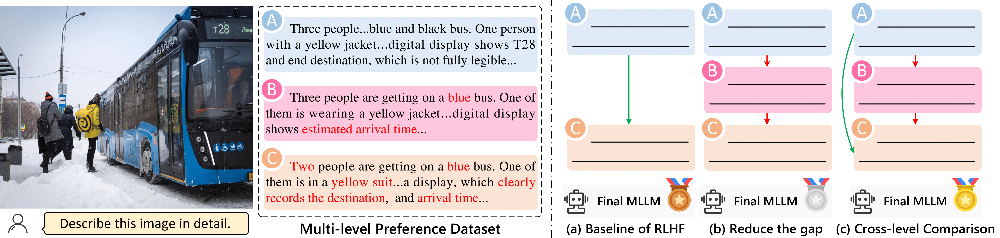
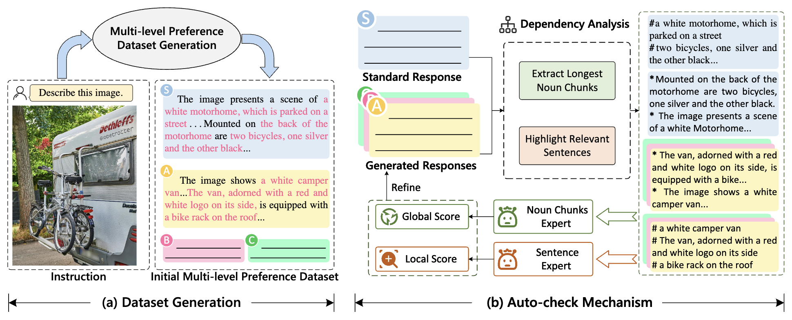
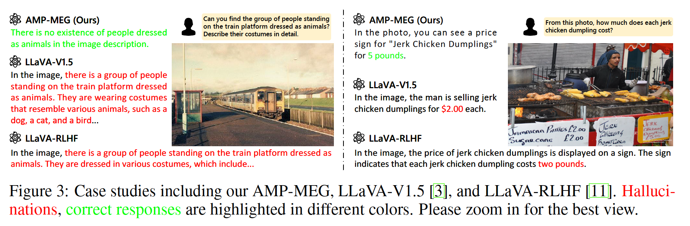

<div align="center">

<h1> Automated Multi-level Preference for MLLMs </h1>

<h4 align="center"> 

<a href='https://arxiv.org/abs/2405.11165'></a>
<a href='https://huggingface.co/collections/mengxizhang/amp-665589e5fda461267cfb402f'></a>

[Mengxi Zhang](https://scholar.google.com/citations?user=73tAoEAAAAAJ&hl=en),
[Wenhao Wu](https://whwu95.github.io/),
[Yu Lu](),
[Yuxin Song](),


[Kang Rong](),
[Huanjin Yao](https://scholar.google.com/citations?user=pDtsCBQAAAAJ&hl=zh-CN),
[Jianbo Zhang](),
[Fanglong Liu](),
[Yifan Sun](),
[Haocheng Feng](),
[Jingdong Wang](https://jingdongwang2017.github.io/)


</h4>
</div>

***
## News  
- [x] **[2024/05/29]** We relase **AMP** in [arxiv](https://arxiv.org/abs/2405.11165)! Our code, [MRHal Benchmark](https://huggingface.co/datasets/mengxizhang/MRHal-Bench), and [models](https://huggingface.co/collections/mengxizhang/amp-665589e5fda461267cfb402f) are now open source!


## Overview


We present an automated Multi-level Preference (AMP) framework for Reinforcement Learning from Human Feedback (RLHF), which generates the high-quality multi-level preference dataset without any human/AI annotators and employs multi-level DPO (MDPO) algorithm. Our AMP achieves SOTA performance across multiple hallucination benchmarks, including MMHal-Bench, MRHal-Bench, LLaVA-Bench, and POPE.

<div align=center>

</div>


<div align=center>

    
Pipeline for Constructing Human-free Multi-level Preference Dataset
</div>

## Prepare
1. Install some important packages.
```Shell
conda create -n amp python=3.10 -y
conda activate amp
pip install --upgrade pip
pip install -r requirements.txt
```

2. Download Base Model

    [llava-7b-base](https://huggingface.co/mengxizhang/amp-7b-base)

    [llava-13b-base](https://huggingface.co/mengxizhang/amp-13b-base)

## Train
1. Prepare data from [[RLHF-V](https://rlhf-v.github.io/)], [[SILKIE](https://vlf-silkie.github.io/)], [[ShareGPT4V](https://sharegpt4v.github.io/)].

2. Download Data from [this link](https://pan.baidu.com/s/1-UnYpNZfMDtwp_T5emwG7g?pwd=6u3w).

3. Run the following code

```Shell
sh scripts/13b-v1.5/train_dpo.sh    # 13B
sh scripts/7b-v1.5/train_dpo.sh     # 7B
```

## Evaluation
### MMHal-Bench
1. Download data from [[MMHal-Bench](https://huggingface.co/datasets/Shengcao1006/MMHal-Bench)].
2. Run the script
```Shell
sh eval/eval_scripts/eval_mmhal.sh
```
### MRHal-Bench
1. Download data from [[MRHal-Bench](https://huggingface.co/datasets/mengxizhang/MRHal-Bench)].
2. Run the script
```Shell
sh eval/eval_scripts/eval_mrhal.sh
```

### LLaVA-Bench
1. Download data from [[LLaVA-Bench](https://github.com/llava-rlhf/LLaVA-RLHF/tree/main/Eval/llava)] and [[COCO](https://cocodataset.org/)] images.
2. Run the script
```Shell
sh eval/eval_scripts/eval_pope.sh
```

### POPE
1. Download data from [[POPE](https://github.com/AoiDragon/POPE/tree/e3e39262c85a6a83f26cf5094022a782cb0df58d/output/coco)] and [[COCO](https://cocodataset.org/)] images.
2. Run the script
```Shell
sh eval/eval_scripts/eval_llavab.sh
```

## Model Zoo
You can also use our trained models for evaluation. We provide the lora adpater of each version.
| Size| Dataset | Link | 
|----------|----------|-----------|
| 7B | MEG | [MEG-7B](https://huggingface.co/mengxizhang/amp_meg_7b) |
| 7B | IG | [IG-7B](https://huggingface.co/mengxizhang/amp_ig_7b) |
| 13B | MEG | [MEG-13B](https://huggingface.co/mengxizhang/amp_meg_13b) |
| 13B | IG | [IG-13B](https://huggingface.co/mengxizhang/amp_ig_13b) |

## Dialogue Example

We provide several dialogue examples, with additional results available in the [paper](https://arxiv.org/abs/2405.11165).

<div align=center>

</div>

## Citation
If you find this repository is useful, please consider star🌟 this repo and cite🖇️ our paper.
```bibtex
@article{zhang2024amp,
      title={Automated Multi-level Preference for MLLMs}, 
      author={Zhang, Mengxi and Wu, Wenhao and Yu, Lu and Song, Yuxin and Rong, Kang and Yao, Huanjin and Zhang, Jianbo and Liu, Fanglong and Feng, Haocheng and Sun, Yifan and Wang, Jingdong},
      journal={arXiv preprint arXiv:2405.11165},
      year={2024}
}
```

## Thanks
Our code is partly based on [[LLaVA](https://llava-vl.github.io/)], [[LLaVA-RLHF](https://llava-rlhf.github.io/)], and [[TRL](https://github.com/huggingface/trl)]. Thanks for their excllent work!
